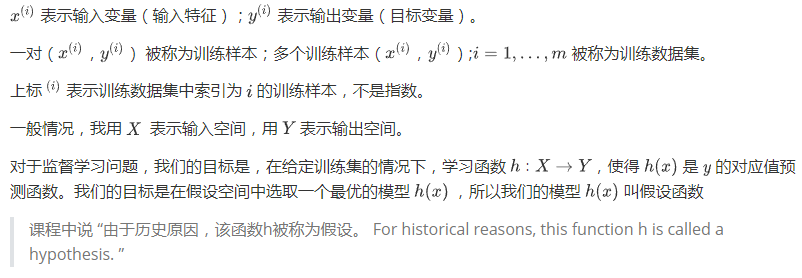
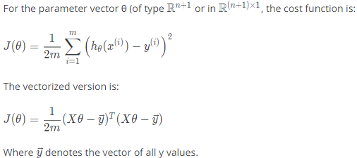
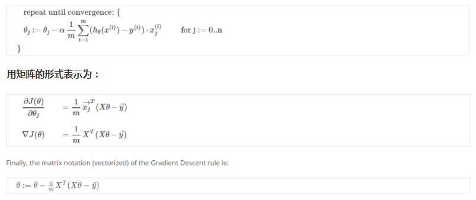

# 模型表示、参数学习

### 模型

### 成本函数（Cost function）

损失函数(Loss function)是定义在**单个训练样本**上的，也就是就算一个样本的误差，用 L 表示。

成本函数(Cost function)，也叫代价函数，是定义在**整个训练集**上面的，也就是所有样本的误差的总和的平均，也就是损失函数的总和的平均。

> 这个方程又称“平方误差函数(Squared error function)” 或者“均值平方误差（Mean squared error）”。 “均值”是一半（1/2m），这方便计算计算梯度下降（gradient descent），平方函数的导数将会抵消 (1/2m)。同样是为了计算的方便，把假设函数的常数看成特征值为1的一个特征，所以 θ 为 n+1 维。

### 参数学习

