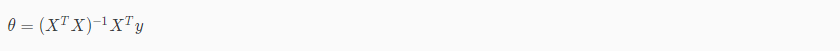
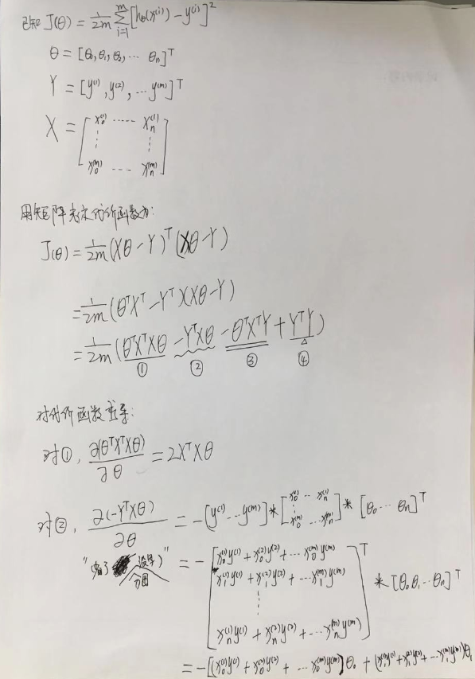
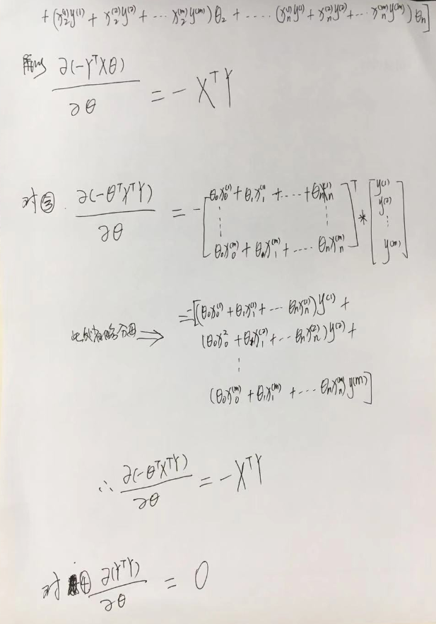
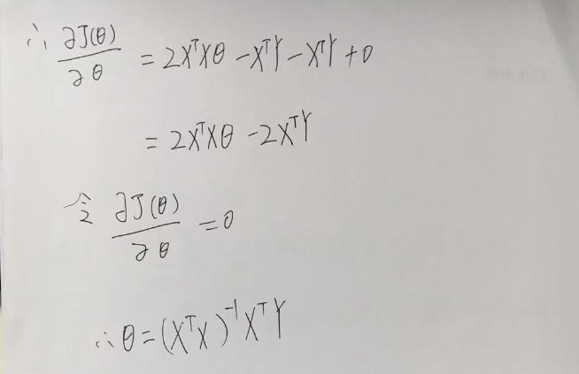

# 特征缩放

目的：让不同的特征有相似的取值范围，确保收敛速度更快。

原因：每个输入值在大致相同的范围可以加速梯度下滑，同时θ将在小范围内快速下降并且在大范围内缓慢下降，

所以特征缩放并不是必须的操作。

#### 特征缩放

当前特征**输入值**除以输入值的**范围**（最大值减去最小值）。

#### 均值归一化

当前特征**输入值**减去**平均值**后除以**输入值的范围**（最大值减去最小值）。

More , https://en.wikipedia.org/wiki/Feature_scaling

# Learning Rate

如果 $\alpha$ 太小：收敛慢。

如果 $\alpha$ 太大：可能不会在每次迭代时减少，因此可能不会收敛。

如果J（θ）在一次迭代中减小小于E，则声明收敛，其中E是一些小值，例如$10^{-3}$， 但是在实践中很难选择这个阈值。

## 标准方程（Normal Equation）

前面我们通过梯度下降的方法来学习参数，该方法是通过迭代的在假设空间中找到一个最佳的模型，而**标准方程**也学习参数的方法之一，其通过令代价函数对**θ**的偏导数等于0直接求得。

The normal equation formula is given below:

其推导过程如下：

There is **no need** to do feature scaling with the normal equation.

